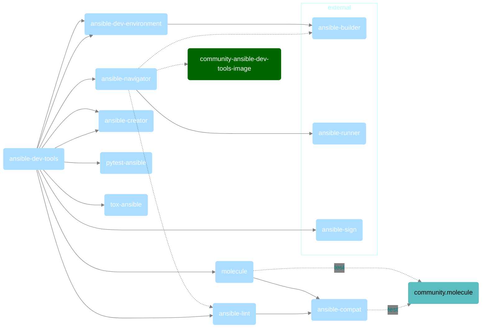
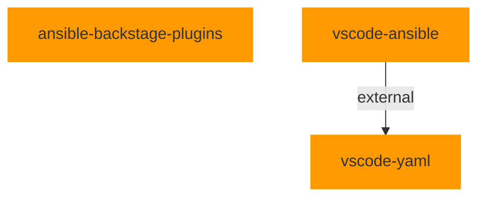
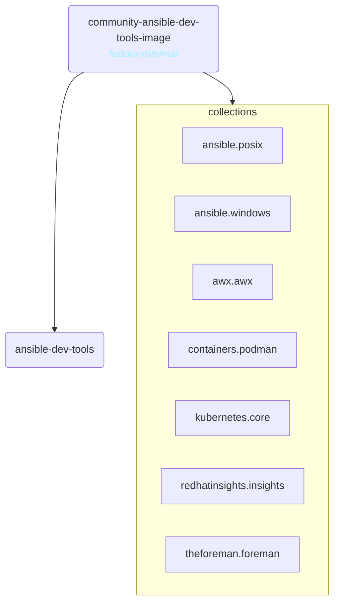
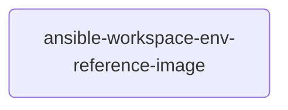

---
hide:
  - toc
---

# devtools

This repository is used to share practices, workflows and decisions affecting projects maintained by Ansible DevTools team.

## Python DevTools project dependencies

It should be noted that our vscode extension would either depend on `ansible-dev-tools` python package or directly use the [execution environment container image](#container-image).

## TypeScript repositories

## Container Image

`community-ansible-dev-tools-image` **execution environment** is a development
**container image** that contains most of the most important tools used in the
development and testing of collections. Still, while we bundle several
collections in it, you need to be warned that **we might remove any included
collection without notice** if that prevents us from
building the container.

## Internal

