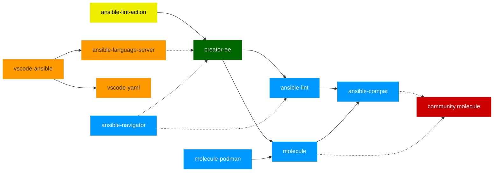
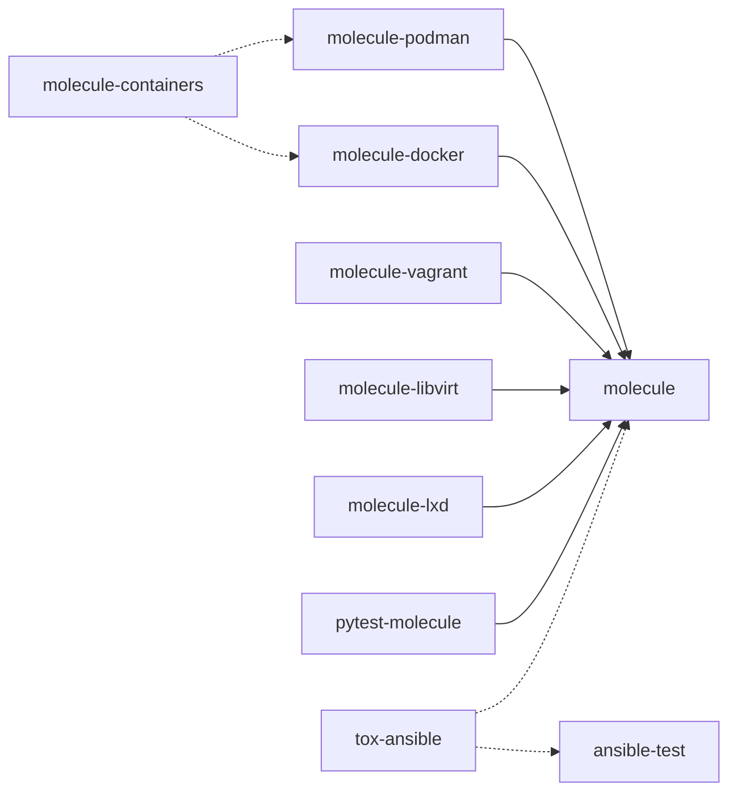

# devtools

This repository is used to share practices, workflows and decisions affecting projects maintained by Ansible DevTools team.

## Main devtools project dependencies

Note:
1. [vscode-yaml](https://github.com/redhat-developer/vscode-yaml) project is not directly supported by Ansible devtools team.
2. dotted lines are either test, build or optional requirements
3. 📘 python, 📙 typescript, 📕 ansible collection, 📗 container 📒 github action

## Molecule ecosystem

