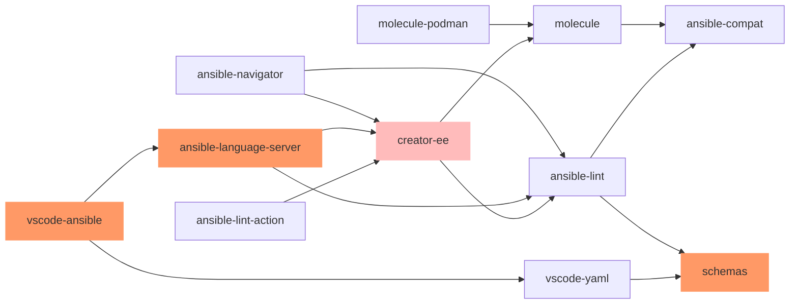

# devtools
[POC] Shared practices, workflows and decisions impacting Ansible devtools projects

## Main devtools project dependencies

Note:
1. [vscode-yaml](https://github.com/redhat-developer/vscode-yaml) project is not directly supported by Ansible devtools team.
