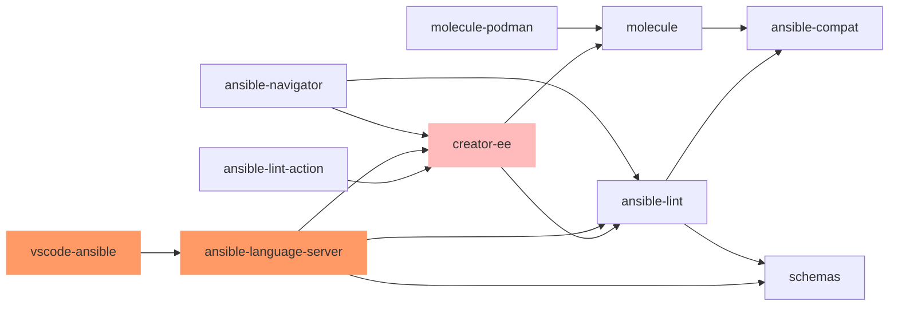

# devtools
[POC] Shared practices, workflows and decisions impacting Ansible devtools projects

## Main devtools project dependencies

```mermaid
graph LR;

  classDef typescriptclass fill:#f96,stroke:#f96;
  classDef containerclass fill:#fbb,stroke:#fbb;

  ansible-lint-action --> creator-ee;
  creator-ee --> ansible-lint;

  ansible-lint --> ansible-compat;
  molecule --> ansible-compat;
  creator-ee:::containerclass --> molecule;
  vscode-ansible:::typescriptclass --> ansible-language-server;
  ansible-language-server:::typescriptclass --> ansible-lint;
  ansible-language-server --> creator-ee;

  molecule-podman --> molecule;
  ansible-language-server --> schemas;
  ansible-lint --> schemas;
  ansible-navigator --> ansible-lint;
  ansible-navigator --> creator-ee;

 click ansible-lint-action href "https://github.com/ansible-community/ansible-lint-action"
 click molecule href "https://github.com/ansible-community/molecule"
 click molecule-podman href "https://github.com/ansible-community/molecule-podman"
 click schemas href "https://github.com/ansible-community/schemas"
 click creator-ee href "https://github.com/ansible/creator-ee"
 click ansible-lint href "https://github.com/ansible/ansible-lint"
 click ansible-compat href "https://github.com/ansible/ansible-compat"
 click ansible-navigator href "https://github.com/ansible/ansible-navigator"
 click ansible-language-server href "https://github.com/ansible/ansible-language-server"
 click vscode-ansible href "https://github.com/ansible/vscode-ansible"
```
