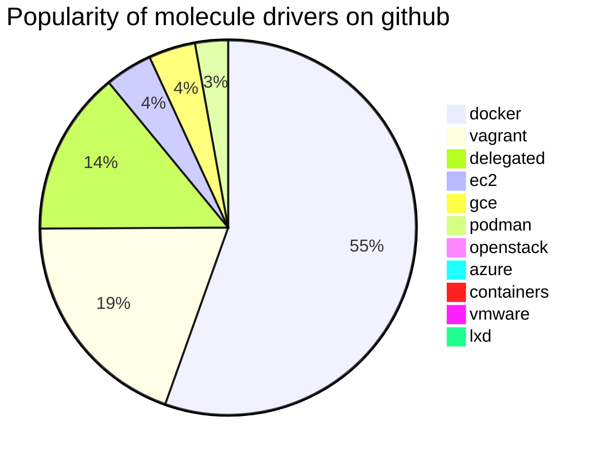

# Molecule Plugins in 2023

As part of the effort to revive molecule project some drastic measures were put in place.

Unmaintained drivers archived between January 5th-8th, 2023: openstack, goss, libvirt, alicloud, vmware, digitalocean, kubevirt, lxd, inspec. Anyone wanting to **revive and maintain** one of these will have to make a pull request against molecule-plugins repository.

The relatively active drivers were moved to [molecule-plugins](https://github.com/ansible-community/molecule-plugins) repository, where we expected them to be maintained by the community.

### Which drivers should we still see in addition to delegated?

* azure
* docker
* containers
* podman
* ec2
* gce
* vagrant

### How did we measure the driver popularity?

With a simple [sourcegraph](https://sourcegraph.com/search?q=context:global+file:molecule.yml+content:%22name:+.*containers%22&patternType=regexp&sm=0) search, we can get an use count for public repos. Here are some of the results:

## What if I used a driver that was not migrated?

If you are using one of the drivers that was not migrated and you want to maintain it, you can start by creating a pull-request towards molecule-plugins repository to add its code there.
